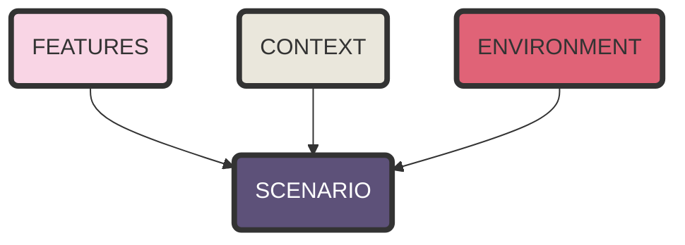

## Scenarios:

We developed several scenarios based on the above-discussed scenarios.

Each scenario is built upon three main elements:

### Scenario 1: Robot Stuck in the Snow

This scenario is based on: 

In this scenario, envision a robot that is designed to perform outdoor tasks. During a heavy snowfall, the robot gets stuck in the deep snow and is unable to move. The robot might need assistance from a human to get out of the snow and continue its tasks.

The environment is: **A street.**

Relevant features in this scenario: 

| Feature | Explanation | Type | Applicable |
| --- | --- | --- | --- |
| Height Limitation (HL) | - | Binary | X |
| Manipulator Limitation (ML) | No manipulators | Binary | X |
| Physical Obstacles (PO) | Snow is a physical obstacle. | Binary | V |
| Mechanical Failure (MF) | Broken wheel. | Binary | V |
| Power Depletion (PD) | Low battery | Binary | V |
| Software Errors (SE) | Missing snow handling procedure \ SW module not loading.  | Binary | V |
| Data Issues (DI) | - | Binary | X |
| Interference (IN) | - | Binary | X |
| Navigation Errors (NE) | - | Binary | X |
| Missing Data (MD) | Might not understand that snow is blocking.  | Binary | V |
| Decision Making (DM) | - | Binary | X |
| Processing Speed (PS) | - | Binary | X |
| Environmental Conditions (EC) | The robot might not be operational in extreme snow.  | Binary | V |
| Costly Alternative Plan (CAP) | There is no alternation. | Multiclass (No Cost, Low Cost, Moderate Cost, No Alternative) | V |
| Harm Prevention (HP) | No Risk / High Risk, Depending on where the robot is stuck on the road.  | Multiclass (No Risk, Low Risk, Moderate Risk, High Risk) | X |
| Task Complexity (TC) | Digging around the robot, using tools to break through ice, or manually lifting and repositioning the robot. | Multiclass (No Effort, Minimal Effort, Noticeable Effort, Considerable Effort, Expert Effort) | V |
| Task Urgency (TU) | Ranging from Not Urgent to Low Urgency, as it’s a food delivery. | Multiclass(Not Urgent, Low Urgency, Moderate Urgency, High Urgency) | V |
| Task Importance (TI) | Ranging from Low to Moderate based on the time waited and number of delivery robots at the time. | Multiclass(Trivial, Low Importance, Moderate Importance, High Importance) | V |
| Task Nature (TN) | A service robot operating in routine delivery. | Multiclass(Routine, Emergency) | V |
| Task Familiarity (TF) | The helper is very knowledgeable about the robot's tasks. They see the robot daily and are well-acquainted with its functions and routines. | Multiclass(Unfamiliar, Somewhat Familiar, Quite Familiar) | V |
| Attention Level (AL) | The request for help is clearly visible and likely to draw immediate attention. It’s in a prominent location where many people are likely to see it. | Multiclass(Barely Noticeable, Highly Noticeable) | V |
| Help Safety (HS) | Ranging from Completely safe to Moderate Risk, based on the position of the robot on the road.  | Multiclass (Completely Safe, Low Risk, Moderate Risk, High Risk) | V |
| Level of Interruption (LI) | Helping the robot takes enough time and effort to cause a noticeable but manageable interruption. | Multiclass(No Interruption, Minor Interruption, Moderate Interruption, Significant Interruption) | V |
| Social Influence and Norms (SN) | “Encouraging others to help”, “helping is a good deed”  | Binary | V |
| Pity (PI) | “Operator will be disappointed”, “The food will be delivered cold” | Binary | V |
| Cost Benefit Analysis (CBA) |  | Binary | V |
| Diffusion of Responsibility (DR) |  | Binary | V |
| Usefulness Assurance (UA) |  | High | V |
| Capability Assurance (CA) |  | Binary | V |
| Communication Clarity (CC) |  | High | V |

Context Vector:

| Feature | Value |
| --- | --- |
| Location (LT) | Urban |
| Time (TD) | Morning |
| Day of the week (DODW) | Not Applicable |
| Season (SS) | Winter |
| Visibility (VB) | Clear |
| Crowd Density (CD) | Sparse |
| Cultural Norms (CN) | Not Applicable |
| Bystander Roles (BR) | Passengers |
| Activity Level (AL) | Low Activity |
| Familiarity (Robot)  | Familiar |
| Role (Robot) | Delivery |
| Type (Robot)  | Wheeled |
| Size (Robot) | Medium |

### Scenario 2: Robot sorting items

This scenario is based on: 

In this scenario, the robot’s task is to sort garbage. There are two waste constrainers in front of the robot, one for plastic and one for glass. 

The environment is: **Office Building**

Relevant features in this scenario: 

| Feature | Explanation | Type | Applicable |
| --- | --- | --- | --- |
| Height Limitation (HL) | - | Binary | X |
| Manipulator Limitation (ML) | Manipulators too short. They cannot grasp the item correctly. | Binary | V |
| Physical Obstacles (PO) | - | Binary | X |
| Mechanical Failure (MF) | Manipulator failure, sensorial failure. | Binary | V |
| Power Depletion (PD) | Low battery | Binary | V |
| Software Errors (SE) | Sorting module won’t load, missing module to detect the item.  | Binary | V |
| Data Issues (DI) | - | Binary | X |
| Interference (IN) | - | Binary | X |
| Navigation Errors (NE) | - | Binary | X |
| Missing Data (MD) | Might not recognize the material of the item, Might not recognize the item itself.  | Binary | V |
| Decision Making (DM) | Might not be able to make a decision regarding the item’s material. | Binary | V |
| Processing Speed (PS) | - | Binary | X |
| Environmental Conditions (EC) | - | Binary | X |
| Costly Alternative Plan (CAP) | Putting the item a side and not handling it. | Multiclass (No Cost, Low Cost, Moderate Cost, No Alternative) | V |
| Harm Prevention (HP) | No risk at all. | Multiclass (No Risk, Low Risk, Moderate Risk, High Risk) | V |
| Task Complexity (TC) | Identifying the material of the object and sorting it accordingly. If a single item the effort is minimal if multiple items might become noticeable. | Multiclass (No Effort, Minimal Effort, Noticeable Effort, Considerable Effort, Expert Effort) | V |
| Task Urgency (TU) | Not urgent at all. | Multiclass(Not Urgent, Low Urgency, Moderate Urgency, High Urgency) | V |
| Task Importance (TI) | Ranging from Trivial to Low based on the time waited. | Multiclass(Trivial, Low Importance, Moderate Importance, High Importance) | V |
| Task Nature (TN) | A service robot operating in routine sorting task. | Multiclass(Routine, Emergency) | V |
| Task Familiarity (TF) | Task is outside the helper’s usual activities. | Multiclass(Unfamiliar, Somewhat Familiar, Quite Familiar) | V |
| Attention Level (AL) | The request for help is clearly visible and likely to draw immediate attention. It’s in a prominent location where many people are likely to see it. | Multiclass(Barely Noticeable, Highly Noticeable) | V |
| Help Safety (HS) | Completely Safe.   | Multiclass (Completely Safe, Low Risk, Moderate Risk, High Risk) | V |
| Level of Interruption (LI) | Helping the robot takes enough time and effort to cause a noticeable but manageable interruption. | Multiclass(No Interruption, Minor Interruption, Moderate Interruption, Significant Interruption) | V |
| Social Influence and Norms (SN) | “Encouraging others to help”, “helping is a good deed”  | Binary | V |
| Pity (PI) | “Operator will be disappointed” | Binary | V |
| Cost Benefit Analysis (CBA) |  | Binary | V |
| Diffusion of Responsibility (DR) |  | Binary | V |
| Usefulness Assurance (UA) |  | High | V |
| Capability Assurance (CA) |  | Binary | V |
| Communication Clarity (CC) |  | High | V |

Context Vector:

| Feature | Value |
| --- | --- |
| Location (LT) | Office Building |
| Time (TD) | Not Applicable |
| Day of the week (DODW) | Not Applicable |
| Season (SS) | Not Applicable |
| Visibility (VB) | Clear |
| Crowd Density (CD) | Moderated |
| Cultural Norms (CN) | Not Applicable |
| Bystander Roles (BR) | Workers |
| Activity Level (AL) | Moderate Activity |
| Familiarity (Robot)  | Familiar |
| Role (Robot) | Service |
| Type (Robot)  | Humanoid |
| Size (Robot) | Large |

### Scenario 3: Robot In an Hospital’s Elevator

This scenario is based on: 

????

In this scenario, the robot struggles to call the elevator’s button, requiring assistance.

The environment is: **Hospital**

Relevant features in this scenario: 

| Feature | Explanation | Type | Applicable |
| --- | --- | --- | --- |
| Height Limitation (HL) | The robot might be too short. | Binary | V |
| Manipulator Limitation (ML) | The manipulators might not be capable of calling an elevator, or precise enough.  | Binary | V |
| Physical Obstacles (PO) | - | Binary | X |
| Mechanical Failure (MF) | Failure in the manipulator | Binary | V |
| Power Depletion (PD) | Low battery | Binary | V |
| Software Errors (SE) | Error in Button Detection Algorithm, Incorrect Arm Positioning Calculation, Failure in Touch Sensitivity Adjustment | Binary | V |
| Data Issues (DI) | - | Binary | X |
| Interference (IN) | - | Binary | X |
| Navigation Errors (NE) | - | Binary | X |
| Missing Data (MD) | - | Binary | X |
| Decision Making (DM) | - | Binary | X |
| Processing Speed (PS) | - | Binary | X |
| Environmental Conditions (EC) | - | Binary | X |
| Costly Alternative Plan (CAP) | Using the stairs, Waiting another individual to call the elevator. | Multiclass (No Cost, Low Cost, Moderate Cost, No Alternative) | V |
| Harm Prevention (HP) | No Risk at all. | Multiclass (No Risk, Low Risk, Moderate Risk, High Risk) | X |
| Task Complexity (TC) | No effort in pressing a button. | Multiclass (No Effort, Minimal Effort, Noticeable Effort, Considerable Effort, Expert Effort) | V |
| Task Urgency (TU) | Depending on the task of the robot, any of those is applicable. | Multiclass(Not Urgent, Low Urgency, Moderate Urgency, High Urgency) | V |
| Task Importance (TI) | Depending on the task of the robot, any of those is applicable. | Multiclass(Trivial, Low Importance, Moderate Importance, High Importance) | V |
| Task Nature (TN) | Depending on the task of the robot, any of those is applicable. | Multiclass(Routine, Emergency) | V |
| Task Familiarity (TF) | The helper is very knowledgeable about the robot's tasks. They see the robot daily and are well-acquainted with its functions and routines. | Multiclass(Unfamiliar, Somewhat Familiar, Quite Familiar) | V |
| Attention Level (AL) | The request for help is clearly visible and likely to draw immediate attention. It’s in a prominent location where many people are likely to see it. | Multiclass(Barely Noticeable, Highly Noticeable) | V |
| Help Safety (HS) | Completely safe. | Multiclass (Completely Safe, Low Risk, Moderate Risk, High Risk) | V |
| Level of Interruption (LI) | - | Multiclass(No Interruption, Minor Interruption, Moderate Interruption, Significant Interruption) | V |
| Social Influence and Norms (SN) | “Encouraging others to help”, “helping is a good deed”  | Binary | V |
| Pity (PI) | “Operator will be disappointed”, “The food will be delivered cold” | Binary | V |
| Cost Benefit Analysis (CBA) |  | Binary | V |
| Diffusion of Responsibility (DR) |  | Binary | V |
| Usefulness Assurance (UA) |  | High | V |
| Capability Assurance (CA) |  | Binary | V |
| Communication Clarity (CC) |  | High | V |

Context Vector:

| Feature | Value |
| --- | --- |
| Location (LT) | Hospital |
| Time (TD) | Day |
| Day of the week (DODW) | Weekday |
| Season (SS) | Not Applicable |
| Visibility (VB) | Clear |
| Crowd Density (CD) | Crowded |
| Cultural Norms (CN) | Not Applicable |
| Bystander Roles (BR) | Mixture |
| Activity Level (AL) | High Activity |
| Familiarity (Robot)  | Familiar |
| Role (Robot) | Service |
| Type (Robot)  | Humanoid |
| Size (Robot) | Medium |

### Scenario 3: Guideless Robot for Visually impaired individuals

This scenario is based on: 

Robots guide visually impaired individuals along a predefined path to reach a destination, The robot relies on sensors and pre-programmed paths to navigate. Errors in localization or navigation can occur due to sensor malfunctions, GPS inaccuracies, or environmental factors like signal interference.

The environment is: **Streets**

Relevant features in this scenario: 

| Feature | Explanation | Type | Applicable |
| --- | --- | --- | --- |
| Height Limitation (HL) | - | Binary | X |
| Manipulator Limitation (ML) | - | Binary | X |
| Physical Obstacles (PO) | The robot might encounter a physical obstacle that it might not be able to pass, or to help the individual to pass. | Binary | V |
| Mechanical Failure (MF) | Broken wheel, Broken manipulator, imperfect sensor. | Binary | V |
| Power Depletion (PD) | Low battery | Binary | V |
| Software Errors (SE) | Sensor Integration Failure, Collision Avoidance System Malfunctions.. | Binary | V |
| Data Issues (DI) | Outdated Mapping Data, Incomplete Sensor Data, Inaccurate GPS Data,  | Binary | V |
| Interference (IN) | Signal Interference, Electromagnetic Interference, Acoustic Interference,  | Binary | V |
| Navigation Errors (NE) | Path Deviation, Localization Errors | Binary | V |
| Missing Data (MD) | The robot's map doesn’t include a recently added construction zone. The robot enters a tunnel or dense urban area where GPS signals are weak or unavailable. The robot faces a detour sign that is not clearly marked in its system | Binary | V |
| Decision Making (DM) | The robot needs to decide between a path that is shorter but riskier and a longer. Due to malfunction the robot cannot decide on the best alternative route.  | Binary | V |
| Processing Speed (PS) | Navigating a Crowded Street Market, Passing a crosswalk  | Binary | V |
| Environmental Conditions (EC) | Extreme heat. | Binary | V |
| Costly Alternative Plan (CAP) | All applicable based on the concrete scenario | Multiclass (No Cost, Low Cost, Moderate Cost, No Alternative) | V |
| Harm Prevention (HP) | All applicable based on the concrete scenario | Multiclass (No Risk, Low Risk, Moderate Risk, High Risk) | V |
| Task Complexity (TC) | Minimal Effort - if only to give a direction \ crossing a crosswalk
Noticeable Effort - if helping the robot to make a decision regarding a path.  | Multiclass (No Effort, Minimal Effort, Noticeable Effort, Considerable Effort, Expert Effort) | V |
| Task Urgency (TU) | High Urgency - As a person is involved that is waiting. | Multiclass(Not Urgent, Low Urgency, Moderate Urgency, High Urgency) | V |
| Task Importance (TI) | Helping an visually impaired person is considered an high importance task.  | Multiclass(Trivial, Low Importance, Moderate Importance, High Importance) | V |
| Task Nature (TN) | Is a routine task. | Multiclass(Routine, Emergency) | V |
| Task Familiarity (TF) | The helper might have seen those robots around helping blind people so ranging from Somewhat to Quite | Multiclass(Unfamiliar, Somewhat Familiar, Quite Familiar) | V |
| Attention Level (AL) | The request for help is clearly visible and likely to draw immediate attention. It’s in a prominent location where many people are likely to see it. | Multiclass(Barely Noticeable, Highly Noticeable) | V |
| Help Safety (HS) | The robot won’t endanger the impaired person by default so the help will be safe..  | Multiclass (Completely Safe, Low Risk, Moderate Risk, High Risk) | V |
| Level of Interruption (LI) | Minor Interruption - if helping getting directions or passing a crosswalk. 
Moderate Interruption - if helping making a decision.  | Multiclass(No Interruption, Minor Interruption, Moderate Interruption, Significant Interruption) | V |
| Social Influence and Norms (SN) | “Encouraging others to help”, “helping is a good deed”  | Binary | V |
| Pity (PI) | “Operator will be disappointed”, “The food will be delivered cold” | Binary | V |
| Cost Benefit Analysis (CBA) |  | Binary | V |
| Diffusion of Responsibility (DR) |  | Binary | V |
| Usefulness Assurance (UA) |  | High | V |
| Capability Assurance (CA) |  | Binary | V |
| Communication Clarity (CC) |  | High | V |

Context Vector:

| Feature | Value |
| --- | --- |
| Location (LT) | Streets |
| Time (TD) | Day |
| Day of the week (DODW) | Weekday |
| Season (SS) | Sunny |
| Visibility (VB) | Clear |
| Crowd Density (CD) | Crowded |
| Cultural Norms (CN) | High helping culture |
| Bystander Roles (BR) | Mixture |
| Activity Level (AL) | High Activity |
| Familiarity (Robot)  | Unfamilier |
| Role (Robot) | Service |
| Type (Robot)  | Humanoid |
| Size (Robot) | Medium |

### Scenario 4: Robot In an Hospital’s Elevator

This scenario is based on: 

__________

In this scenario, the robot struggles to call the elevator’s button, requiring assistance.

The environment is: **Hospital**

Relevant features in this scenario: 

| Feature | Explanation | Type | Applicable |
| --- | --- | --- | --- |
| Height Limitation (HL) | The robot might be too short. | Binary | V |
| Manipulator Limitation (ML) | The manipulators might not be capable of calling an elevator, or precise enough.  | Binary | V |
| Physical Obstacles (PO) | - | Binary | X |
| Mechanical Failure (MF) | Failure in the manipulator | Binary | V |
| Power Depletion (PD) | Low battery | Binary | V |
| Software Errors (SE) | Error in Button Detection Algorithm, Incorrect Arm Positioning Calculation, Failure in Touch Sensitivity Adjustment | Binary | V |
| Data Issues (DI) | - | Binary | X |
| Interference (IN) | - | Binary | X |
| Navigation Errors (NE) | - | Binary | X |
| Missing Data (MD) | - | Binary | X |
| Decision Making (DM) | - | Binary | X |
| Processing Speed (PS) | - | Binary | X |
| Environmental Conditions (EC) | - | Binary | X |
| Costly Alternative Plan (CAP) | Using the stairs, Waiting another individual to call the elevator. | Multiclass (No Cost, Low Cost, Moderate Cost, No Alternative) | V |
| Harm Prevention (HP) | No Risk at all. | Multiclass (No Risk, Low Risk, Moderate Risk, High Risk) | X |
| Task Complexity (TC) | No effort in pressing a button. | Multiclass (No Effort, Minimal Effort, Noticeable Effort, Considerable Effort, Expert Effort) | V |
| Task Urgency (TU) | Depending on the task of the robot, any of those is applicable. | Multiclass(Not Urgent, Low Urgency, Moderate Urgency, High Urgency) | V |
| Task Importance (TI) | Depending on the task of the robot, any of those is applicable. | Multiclass(Trivial, Low Importance, Moderate Importance, High Importance) | V |
| Task Nature (TN) | Depending on the task of the robot, any of those is applicable. | Multiclass(Routine, Emergency) | V |
| Task Familiarity (TF) | The helper is very knowledgeable about the robot's tasks. They see the robot daily and are well-acquainted with its functions and routines. | Multiclass(Unfamiliar, Somewhat Familiar, Quite Familiar) | V |
| Attention Level (AL) | The request for help is clearly visible and likely to draw immediate attention. It’s in a prominent location where many people are likely to see it. | Multiclass(Barely Noticeable, Highly Noticeable) | V |
| Help Safety (HS) | Completely safe. | Multiclass (Completely Safe, Low Risk, Moderate Risk, High Risk) | V |
| Level of Interruption (LI) | - | Multiclass(No Interruption, Minor Interruption, Moderate Interruption, Significant Interruption) | V |
| Social Influence and Norms (SN) | “Encouraging others to help”, “helping is a good deed”  | Binary | V |
| Pity (PI) | “Operator will be disappointed”, “The food will be delivered cold” | Binary | V |
| Cost Benefit Analysis (CBA) |  | Binary | V |
| Diffusion of Responsibility (DR) |  | Binary | V |
| Usefulness Assurance (UA) |  | High | V |
| Capability Assurance (CA) |  | Binary | V |
| Communication Clarity (CC) |  | High | V |

Context Vector:

| Feature | Value |
| --- | --- |
| Location (LT) | Hospital |
| Time (TD) | Day |
| Day of the week (DODW) | Weekday |
| Season (SS) | Not Applicable |
| Visibility (VB) | Clear |
| Crowd Density (CD) | Crowded |
| Cultural Norms (CN) | Not Applicable |
| Bystander Roles (BR) | Mixture |
| Activity Level (AL) | High Activity |
| Familiarity (Robot)  | Familiar |
| Role (Robot) | Service |
| Type (Robot)  | Humanoid |
| Size (Robot) | Medium |